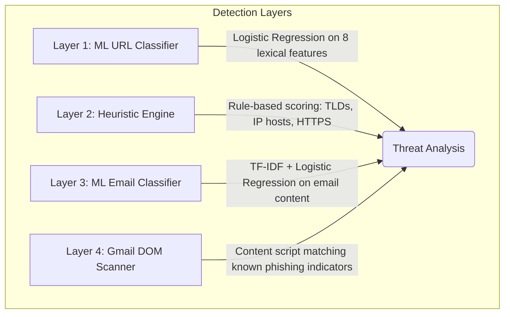

# PhishGuard 🛡️

**Real-time phishing detection powered by Machine Learning, heuristic analysis, and Gmail email scanning.**

PhishGuard is a comprehensive cybersecurity system that protects users from phishing attacks across two surfaces: **malicious URLs** (detected in real-time as you browse) and **phishing emails** (scanned directly inside Gmail). It combines a trained ML backend with a Chrome extension that acts as your always-on security shield.

## 🎯 How It Works

PhishGuard uses a **multi-layered detection approach**:

### URL Protection Flow

1. You navigate to a website → the **Chrome extension** captures the URL
2. The URL is sent to the **FastAPI backend** for analysis
3. The backend extracts **8 lexical features** and runs the **ML model**
4. A **heuristic engine** adds rule-based scoring on top
5. If the combined score exceeds 60% → the page is **blocked** and a warning is shown
6. You can choose to **go back to safety** or **proceed anyway**

### Gmail Email Protection Flow

1. You open **Gmail** → the content script activates automatically
2. A **MutationObserver** watches for inbox changes (Gmail is a Single Page App)
3. For each email row, the scanner extracts **sender, subject, snippet, and links**
4. **Local analysis** checks against known phishing domains, urgency phrases, URL shorteners, and mismatched links
5. **Backend ML analysis** classifies the email text as safe or phishing using the trained TF-IDF model
6. Flagged emails get a **red border** and a **"⚠ Phishing Risk" badge** with a hover tooltip explaining why

## 🚀 Key Features

| Feature | Description |
|---------|-------------|
| **Real-time URL Blocking** | Intercepts phishing URLs before the page loads |
| **Gmail Email Scanning** | Scans inbox emails directly from the DOM for phishing indicators |
| **ML-Powered Detection** | Two trained classifiers — one for URLs, one for email content |
| **Dataset-Driven** | Models trained on real phishing URL and email datasets, not hardcoded rules |
| **Known Domain Database** | 101 phishing domains auto-extracted from dataset + 20 URL shortener services |
| **Urgency Phrase Detection** | 65+ phrases like "verify your account", "your account will be closed" |
| **Mismatched Link Detection** | Flags links where displayed text differs from actual destination |
| **Detailed Verdicts** | Shows risk scores, ML probabilities, heuristic contributions, and specific reasons |
| **Privacy-Focused** | All processing is local — no data leaves your machine |
| **Cyberpunk Web Dashboard** | Terminal-style manual URL scanner with Matrix-rain visual effects |
